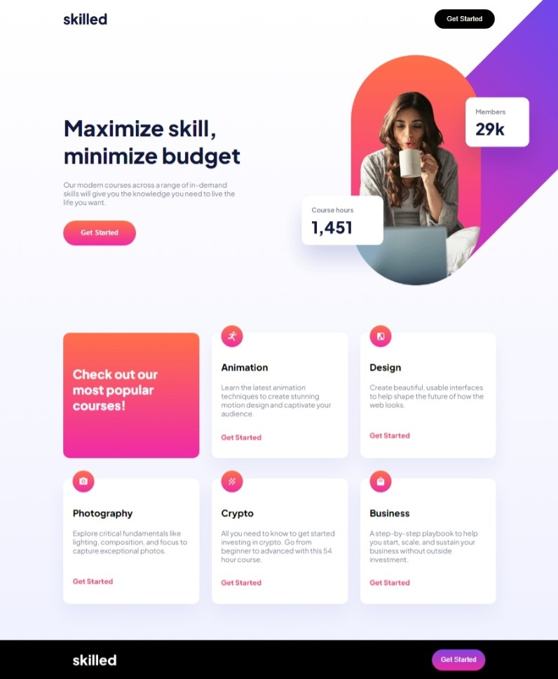

# Frontend Mentor - Skilled e-learning landing page solution

This is a solution to the [Skilled e-learning landing page challenge on Frontend Mentor](https://www.frontendmentor.io/challenges/skilled-elearning-landing-page-S1ObDrZ8q). Frontend Mentor challenges help you improve your coding skills by building realistic projects.

## Table of contents

- [Overview](#overview)
  - [The challenge](#the-challenge)
  - [Screenshot](#screenshot)
  - [Links](#links)
- [My process](#my-process)
  - [Built with](#built-with)
  - [What I learned](#what-i-learned)
  - [Continued development](#continued-development)
  - [Useful resources](#useful-resources)
- [Author](#author)

## Overview

### The challenge

Users should be able to:

- View the optimal layout depending on their device's screen size
- See hover states for interactive elements

### Screenshot

### Links

- Solution URL: [Frontend Mentor Solution Page](https://www.frontendmentor.io/solutions/responsive-landing-page-with-a-tricky-offset-hero-image-s3yod2lOom)
- Live Site URL: [Hosted on GitHub Page](https://aleknovkovski.github.io/FEM-skilled-elearning-landing-page/working)

## My process

### Built with

- Semantic HTML5 markup
- CSS custom properties
- Flexbox
- CSS Grid

### What I learned

- I learned more about utilizing background-image positioning for unique designs where the designer intended for an image to start off-screen
- I gained a deeper understanding of how to think responsively

### Continued development

I need to practice more with designs where the responsivness can be tricky in order to get faster and more efficient. 

## Author

- Frontend Mentor - [@aleknovkovski](https://www.frontendmentor.io/profile/aleknovkovski)
- Linkedin - [@aleknovkovski](https://www.linkedin.com/in/aleknovkovski/)
